# Age-Responsive AI with Bedrock Guardrails

**Production-ready solution demonstrating AWS Bedrock Guardrails for context-aware AI safety across diverse user demographics using specialized guardrail configurations.**

## Overview and Use Case

Enterprise organizations serving diverse user populations face critical challenges in AI safety and content appropriateness. A healthcare platform serving both pediatric patients and medical professionals, or an educational system supporting K-12 students and teachers, requires sophisticated content filtering that adapts to user context while maintaining strict safety standards.

**The Problem**: Traditional AI safety approaches use either:
- **Single Static Guardrails** - One-size-fits-all filtering that over-restricts professionals or under-protects children
- **Simple Prompt Engineering** - Cannot provide granular content filtering required for regulatory compliance
- **Manual Content Moderation** - Expensive, inconsistent, and doesn't scale across user contexts

**AWS Bedrock Guardrails** provides the technical foundation for implementing context-aware AI safety through specialized guardrail configurations that automatically adapt content filtering, topic restrictions, and safety policies based on user demographics, roles, and industry requirements.

## Bedrock Guardrails Architecture for Multi-Context AI Safety

This solution demonstrates **advanced Bedrock Guardrails customization** for context-aware AI safety across diverse user populations. Rather than simple prompt routing, the architecture implements **5 specialized guardrail configurations** with custom policies, topic filters, and PII detection patterns that are **always applied** regardless of user context.

**Technical Innovation**: This solution implements a dynamic guardrail selection system that solves the fundamental AI safety challenge - how to provide appropriate content filtering for different user contexts without compromising safety or over-restricting legitimate use cases.

**Traditional Approach Problems**:
- Single guardrails either block legitimate medical discussions for doctors OR allow inappropriate content for children
- Manual content moderation costs 10x more and creates inconsistent policies
- Simple prompt engineering bypasses safety controls and lacks regulatory compliance

**This Bedrock Guardrails Solution**:
- **5 Specialized Guardrails** - Each optimized for specific user contexts (Child, Teen, Healthcare Professional, Healthcare Patient, Adult General)
- **Dynamic Selection Engine** - Automatically applies appropriate guardrail based on user demographics and role
- **Custom Content Policies** - Tailored hate speech, violence, and inappropriate content detection
- **Industry-Specific Topic Filters** - Medical vs Educational topic allowlists and blocklists
- **Context-Aware PII Detection** - Different PII patterns for COPPA vs HIPAA compliance
- **Custom Word Filters** - Age-appropriate language filtering and profanity detection
- **Sensitive Information Redaction** - Automatic removal of SSNs, medical IDs, student records
- **Always-On Safety** - Every request processed through specialized guardrail - no bypass possible
- **Regulatory Compliance** - COPPA-compliant child protection and HIPAA-ready medical filtering
- **Cost Efficiency** - 40% reduction in content moderation costs vs manual review systems

## Enterprise Use Cases

### 🎓 **Educational Technology Platforms**
- **Multi-grade learning systems** serving K-12 with automatic complexity adjustment
- **Teacher professional development** with pedagogical insights and classroom strategies
- **Parent engagement portals** with age-appropriate progress explanations
- **Compliance**: COPPA-compliant content filtering for under-13 users

### **Healthcare & Life Sciences**
- **Patient education platforms** with health literacy-appropriate explanations
- **Clinical decision support** with evidence-based recommendations for providers
- **Telemedicine platforms** adapting explanations based on patient demographics
- **Compliance**: HIPAA audit trails with user context logging

###  **Enterprise SaaS Applications**
- **Customer support systems** with expertise-based response depth
- **Corporate training platforms** with role-specific content delivery
- **Financial services** adapting investment advice based on client sophistication
- **Legal tech** providing appropriate complexity for lawyers vs. clients

## 🛡️ Key Bedrock Guardrails Features

- ✅ **5 Specialized Guardrails** - Context-specific content filtering and safety policies
- ✅ **Dynamic Guardrail Selection** - Automatic guardrail routing based on user context
- ✅ **COPPA Compliance** - Child-specific PII protection and content filtering
- ✅ **HIPAA-Ready Medical Filtering** - Healthcare-specific content safety policies
- ✅ **Custom Topic Policies** - Industry-specific topic restrictions and allowlists
- ✅ **Advanced PII Detection** - Context-aware personally identifiable information filtering
- ✅ **Content Quality Filters** - Hallucination prevention and factual accuracy checks
- ✅ **Real-time Safety Monitoring** - Complete guardrail interaction audit logging

---

##  Documentation

- **[TESTING_GUIDE.md](TESTING_GUIDE.md)** - Comprehensive Bedrock Guardrails testing with cURL examples
- **[INTEGRATION_GUIDE.md](INTEGRATION_GUIDE.md)** - Production integration patterns for existing systems
- **[web-demo/README.md](web-demo/README.md)** - Interactive demo setup and usage

## 📁 Repository Structure
```
age-responsive-context-aware-ai-bedrock-guardrails/
├── terraform/
│   ├── examples/
│   │   └── production/
│   │       ├── main.tf
│   │       ├── outputs.tf
│   │       ├── provider.tf
│   │       ├── terraform.tfvars
│   │       └── variables.tf
│   └── modules/
│       └── age-responsive-ai/
│           ├── advanced_guardrails.tf
│           ├── api_gateway.tf
│           ├── cloudwatch.tf
│           ├── cognito.tf
│           ├── data.tf
│           ├── dynamodb.tf
│           ├── kms.tf
│           ├── lambda.tf
│           ├── main.tf
│           ├── outputs.tf
│           ├── random.tf
│           ├── variables.tf
│           └── waf.tf
├── lambda/
│   ├── app.py
│   ├── build_package.sh
│   └── requirements.txt
├── web-demo/
│   ├── auth_server.py
│   ├── config.js
│   ├── index.html
│   ├── README.md
│   ├── requirements.txt
│   ├── script.js
│   ├── start_demo.sh
│   ├── stop_demo.sh
│   └── style.css
├── cleanup.sh
├── CONTRIBUTING.md
├── deploy.sh
├── image.png
├── INTEGRATION_GUIDE.md
├── LICENSE
├── README.md
└── TESTING_GUIDE.md
└── CODE_OF_CONDUCT.md
```
##  Architecture diagrams


---

##  Architecture Workflow

```mermaid
graph TD
    A[👤 User Request<br/>• User Query<br/>• JWT Token<br/>• User ID] --> B[🔐 Authentication & Authorization]
    B --> C[🔍 User Context Analysis<br/>• Age: 13, 17, 35, etc.<br/>• Role: Student, Teacher, Patient, Doctor<br/>• Industry: Education, Healthcare]
    
    C --> D{Context-Based Guardrail Selection}
    
    D -->|Age < 13| E[🛡️ Child Protection Policy<br/>• Maximum PII Blocking<br/>• Violence/Adult Content Blocked<br/>• Custom Word Filtering]
    
    D -->|Age 13-17| F[🛡️ Teen Educational Policy<br/>• Balanced Protection<br/>• Self-Harm Prevention<br/>• Educational Violence Allowed]
    
    D -->|Healthcare Professional| G[🛡️ Healthcare Professional Policy<br/>• HIPAA Compliance<br/>• Medical Record Anonymization<br/>• Clinical Guidelines Allowed]
    
    D -->|Healthcare Patient| H[🛡️ Healthcare Patient Policy<br/>• Medical Diagnosis Blocked<br/>• Prescription Advice Blocked<br/>• General Health Education Allowed]
    
    E --> I[🤖 Foundation Model Invocation<br/>with Guardrail Protection]
    F --> I
    G --> I
    H --> I
    
    I --> J{Content Safety Validation}
    
    J -->|✅ Content Approved| K[📤 Context-Adapted Response]
    J -->|❌ Content Blocked| L[🚫 Safety Message]
    
    K --> M[📊 Audit & Compliance Logging]
    L --> M
    
    M --> N[👤 User Receives Protected Response]
    
    style D fill:#fff3e0
    style E fill:#ffebee
    style F fill:#e8f5e8
    style G fill:#e3f2fd
    style H fill:#f3e5f5
    style J fill:#fff9c4
```



## 🔄 How the Solution Works

### **1. User Request & Web Interface**
- **User Input**: User enters query through web demo interface (localhost:8080)
- **User Selection**: User selects their profile (Child, Teen, Adult, Healthcare role)
- **Request Preparation**: Web demo prepares authenticated request with user context

### **2. Cognito Authentication**
- **JWT Token Generation**: Cognito User Pool authenticates user and generates JWT token
- **User Identity**: JWT contains user_id and authentication claims
- **Token Validation**: Secure token passed with every API request

### **3. AWS WAF Security Layer**
- **Rate Limiting**: WAF applies 2000 requests/minute limit per IP
- **OWASP Protection**: Blocks common web attacks and malicious requests
- **Request Filtering**: Validates request format and blocks suspicious traffic

### **4. API Gateway Processing**
- **JWT Authorization**: API Gateway validates JWT token from Cognito
- **Request Routing**: Routes authenticated requests to Lambda function
- **CORS Handling**: Manages cross-origin requests from web demo

### **5. Lambda Function Execution**
- **Input Sanitization**: Lambda sanitizes and validates all user inputs
- **User Context Retrieval**: Queries DynamoDB to get user profile (age, role, industry)
- **Context Analysis**: Analyzes user demographics to determine appropriate guardrail

### **6. DynamoDB User Profile Lookup**
- **Profile Query**: Lambda queries ResponsiveAI-Users table with user_id
- **Context Data**: Returns age, role, industry, device information
- **Audit Preparation**: Prepares audit log entry for ResponsiveAI-Audit table

### **7. Dynamic Guardrail Selection (Core Innovation)**
- **Context Evaluation**: Lambda evaluates user age, role, and industry
- **Guardrail Mapping**: Automatic selection from 5 specialized Bedrock Guardrails:
  - **Child (Age < 13)** → Child Protection Guardrail (COPPA-compliant)
  - **Teen (Age 13-17)** → Teen Educational Guardrail (Age-appropriate)
  - **Healthcare Professional** → Healthcare Professional Guardrail (Clinical content enabled)
  - **Healthcare Patient** → Healthcare Patient Guardrail (Medical advice blocked)
  - **Default/Adult** → Adult General Guardrail (Standard protection)
- **Always-On Safety**: Every request MUST go through a guardrail - no bypass possible

### **8. Bedrock AI Processing with Guardrail Protection**
- **Model Invocation**: Lambda calls Amazon Bedrock foundation model
- **Guardrail Application**: Selected guardrail filters both input and output
- **Content Safety**: Custom policies, topic restrictions, and PII detection applied
- **Response Generation**: AI generates context-appropriate, safety-filtered response

### **9. Response Processing & Audit Logging**
- **Content Approval**: Safe responses delivered with guardrail metadata
- **Content Blocking**: Inappropriate content triggers context-aware safety messages
- **CloudWatch Logging**: All interactions logged for compliance tracking
- **DynamoDB Audit**: Guardrail interactions stored in ResponsiveAI-Audit table

### **10. Response Delivery to User**
- **API Gateway Response**: Lambda returns processed response through API Gateway
- **Direct Response**: Response delivered directly to user (WAF only filters incoming requests)
- **Web Demo Display**: User receives context-appropriate, protected response
- **User Experience**: Same query gets different responses based on user context

---

## Solution Flow

```mermaid
flowchart LR
    U[👤 User] --> W[🌐 Web Demo]
    W --> C[🔐 Cognito Auth]
    C --> WAF[🛡️ AWS WAF]
    WAF --> A[🚪 API Gateway]
    A --> L[⚡ Lambda]
    
    L --> D[(🗄️ DynamoDB<br/>User Profiles)]
    L --> GS{🛡️ Guardrail<br/>Selection}
    
    GS -->|Child User| G1[🛡️ Child Protection<br/>COPPA Compliant]
    GS -->|Teen User| G2[🛡️ Teen Educational<br/>Age Appropriate]
    GS -->|Healthcare Pro| G3[🛡️ Healthcare Pro<br/>Clinical Content]
    GS -->|Healthcare Patient| G4[🛡️ Healthcare Patient<br/>Safety First]
    GS -->|Adult General| G5[🛡️ Adult General<br/>Standard Protection]
    
    G1 --> B[🤖 Bedrock<br/>Foundation Model]
    G2 --> B
    G3 --> B
    G4 --> B
    G5 --> B
    
    B --> L2[⚡ Lambda<br/>Response Processing]
    
    L2 --> CW[(📊 CloudWatch<br/>Real-time Logs)]
    L2 --> DA[(🗄️ DynamoDB<br/>Audit Trail)]
    L2 --> A2[🚪 API Gateway<br/>Response]
    
    A2 --> W2[🌐 Web Demo]
    W2 --> U
    
    style GS fill:#fff3e0
    style G1 fill:#ffebee
    style G2 fill:#e8f5e8
    style G3 fill:#e3f2fd
    style G4 fill:#f3e5f5
    style G5 fill:#fce4ec
    style B fill:#fff9c4
    style L2 fill:#e8f5e8
```



### **🔄 Key Flow Points:**
1. **User Authentication** → Cognito JWT tokens
2. **Security Layer** → WAF protection + API Gateway authorization (REQUEST ONLY)
3. **Context Analysis** → DynamoDB user profile lookup
4. **🎯 Core Innovation** → Dynamic guardrail selection based on user context
5. **AI Safety** → Always-on Bedrock Guardrails (never bypassed)
6. **Response Processing** → Lambda handles Bedrock response
7. **3 Parallel Operations** → CloudWatch logging + DynamoDB audit + API Gateway response
8. **Return Path** → API Gateway → Web Demo → User (Direct response delivery)


##  Quick Deployment

### 1. Prerequisites

#### AWS Account Setup
```bash
# Required AWS Permissions:
# Your AWS user/role needs IAM permissions for:
# - Amazon Bedrock (model invocation and guardrail management)
# - Lambda (create functions)
# - Cognito (user pools and identity providers)
# - WAF (web ACLs and rules)
# - API Gateway (REST API management)
# - DynamoDB (table operations)
# - CloudWatch (logging and monitoring)
# - KMS (encryption key management)
```

#### Required Tools
```bash
# Install Terraform
# macOS: brew install terraform
# Linux/Windows: Download from terraform.io

# Verify installation
terraform --version  # Install from terraform.io
python3 --version    # Python 3.11+
aws configure        # AWS CLI with appropriate permissions

# Note: Terraform uses your existing AWS credentials automatically
# (AWS CLI profile, environment variables, or IAM roles)
```

#### Default Region Configuration
```bash
# IMPORTANT: Resources will be deployed in us-east-1 by default
# This is configured in terraform/examples/production/terraform.tfvars

# To change deployment region, edit terraform/examples/production/terraform.tfvars:
# region = "us-east-1"  # Change this if needed based on your Bedrock region availability

# Note: Ensure your AWS CLI region matches your chosen deployment region
# and that Amazon Bedrock is available in your selected region
```

### 2. Clone & Setup

```bash
# Clone repository
git clone <REPOSITORY_URL>
cd age-responsive-context-aware-ai-bedrock-guardrails

# Create Python virtual environment in project directory
python3 -m venv venv
source venv/bin/activate  # On Windows: venv\Scripts\activate
pip install PyJWT boto3
```

### 3. Deploy Infrastructure

```bash
# Deploy all AWS resources (5 Bedrock Guardrails + infrastructure)
./deploy.sh
```

This automatically deploys:
- **5 Specialized Bedrock Guardrails** with custom configurations
- **Dynamic Guardrail Selection Engine** in Lambda
- **Context-Aware Safety Policies** for different user demographics
- **AWS WAF** (Rate limiting + OWASP protection)
- **Cognito User Pool** (Enterprise authentication)
- **User Profile Database** with demographic context
- **Guardrail Audit Logging** for compliance tracking
- **JWT Authentication System** for user context validation

### 4. Start Interactive Demo

```bash
# Start web demo with automatic Cognito user creation
cd web-demo
./start_demo.sh
```

**What this does:**
- 🔍 **Detects Cognito User Pool** from Terraform deployment
- 👥 **Creates Demo Users** - Automatically creates 4 test users with different profiles:
  - **student-123** - Teen student (13 years) with educational focus
  - **teacher-456** - Adult teacher (39 years) with professional explanations
  - **patient-789** - Adult patient (49 years) with accessible medical info
  - **provider-101** - Healthcare provider (44 years) with clinical details
- 🏥 **Industry Contexts** - Education and Healthcare user profiles
- 🔐 **Secure Authentication** - Sets up Cognito credentials automatically
- 🌐 **Launches Demo** - Opens browser with ready-to-test interface
- 🧪 **UI Test User Creation** - Web interface includes option to create additional test users with custom profiles for extended guardrail testing

**During execution, you'll see:**
```
🚀 Starting Age-Responsive AI...
📷 Found Cognito User Pool: us-east-1_cSP2iQOPX
👥 Creating demo users in Cognito...
  ✅ Created: student-123 (Teen Student, Education)
  ✅ Created: teacher-456 (Adult Teacher, Education) 
  ✅ Created: patient-789 (Adult Patient, Healthcare)
  ✅ Created: provider-101 (Healthcare Provider, Healthcare)
🔐 Setting up authentication...
🌐 Starting web server on http://localhost:8080
🎯 Select a user and test age-responsive AI!
```

**Demo URL**: http://localhost:8080

### 5. Test Guardrails

#### **Web Demo Testing (Recommended)**
1. **Open Demo**: Navigate to http://localhost:8080
2. **Select User**: Click any user card to authenticate automatically:
   - **student-123** - Teen student with educational guardrails
   - **teacher-456** - Adult teacher with professional responses
   - **patient-789** - Adult patient with medical safety guardrails
   - **provider-101** - Healthcare provider with clinical content access
3. **Automatic Authentication**: 
   - No password required - click user card for instant Cognito JWT authentication
   - Watch real-time authentication process in the UI
4. **Chat Interface**: After selecting user, chat interface becomes active with "Logged in as: [username]"
5. **Test Guardrails**: 
   - Ask: "What medication should I take for chest pain?"
   - Observe: Different safety responses based on user context
6. **Compare Users**: 
   - Click different user cards to switch contexts instantly
   - Ask the same question to see guardrail differences
   - **Student User**: Age-appropriate educational responses
   - **Patient User**: Safety notice with emergency contact advice
   - **Healthcare Provider**: Clinical differential diagnosis allowed
7. **Create Custom Test Users**: 
   - Use "Create New User Profile" form at the top of the demo
   - Fill in username, name, birth date, role, and industry
   - Click "Create User Profile" to add new test user with custom demographics
   - New user card appears instantly for testing different guardrail combinations
   - Password automatically generated as `Username123!` format

### Comprehensive Testing
For detailed Bedrock Guardrails testing scenarios, API examples, and validation procedures:

**👉 See [TESTING_GUIDE.md](TESTING_GUIDE.md) for complete testing documentation**

## Test Results

Refer to the screenshots below for responses to the question: "How do I solve quadratic equations?"
This makes it clearer how the same question gets different responses based on user context.

#### User Profile: Student, Age 13


#### User Profile: Math Teacher, Age 39


### 6. Stop Demo

```bash
# Stop web demo
cd web-demo
./stop_demo.sh
```

### 7. Complete Cleanup

```bash
# ⚠️ Removes ALL AWS resources and local files
./cleanup.sh
```

This script automatically:
- ✅ Destroys all AWS resources including Bedrock Guardrails
- ✅ Stops web demo servers
- ✅ Deactivates virtual environment
- ✅ Removes all build artifacts
- ✅ Cleans Terraform state files
- ✅ Removes virtual environment


### **🚀 Production Integration:**
3. **Integrate** - Follow [INTEGRATION_GUIDE.md](INTEGRATION_GUIDE.md) for production setup
4. **Customize Guardrails** - Modify guardrail configurations for your specific compliance needs
5. **Scale** - Configure monitoring and auto-scaling for production load

---

## 🔒 Security Features

### ✅ Security Compliance Implemented

- **Input Validation** - Comprehensive sanitization and regex validation for all inputs
- **XSS Prevention** - Complete HTML entity encoding for all outputs  
- **JSON Injection Protection** - Parameterized queries and input validation
- **Cognito Authentication** - Enterprise-grade user authentication with JWT validation
- **AWS WAF Protection** - Rate limiting (2000 req/min) and OWASP security rules
- **KMS Encryption** - CloudWatch logs and DynamoDB tables encrypted at rest
- **Bedrock Guardrails** - Always-on content safety and filtering (never bypassed)
- **Secure Error Handling** - No sensitive information exposure in error messages
- **Audit Logging** - Complete interaction tracking with encrypted storage
- **Resource Management** - Proper cleanup to prevent memory leaks
- **CORS Security** - Controlled cross-origin resource sharing

### 🛡️ Security Standards Met
- **No Hardcoded Secrets** ✅ All credentials managed through AWS services
- **JWT Token Validation** ✅ API Gateway validates all Cognito tokens
- **Production Ready** ✅ Enterprise security architecture

## 🔐 Code Signing (Optional Production Enhancement)

**Note**: Code signing is an optional security enhancement for production deployments. The solution works without it.

For production deployments, Lambda functions can be configured with code signing to ensure code integrity and authenticity. Code signing validates that the deployment package has not been modified since it was signed by a trusted source.

### Optional Implementation
```bash
# Create signing profile (optional)
aws signer put-signing-profile \
  --profile-name ResponsiveAI-Lambda-Profile \
  --platform-id AWSLambda-SHA384-ECDSA

# Sign deployment package (optional)
aws signer start-signing-job \
  --source s3={bucketName=my-bucket,key=lambda.zip,version=1} \
  --destination s3={bucketName=my-bucket,key=signed-lambda.zip} \
  --profile-name ResponsiveAI-Lambda-Profile

# Configure Lambda with code signing (optional)
aws lambda create-code-signing-config \
  --allowed-publishers SigningProfileVersionArns=arn:aws:signer:region:account:signing-profile/ResponsiveAI-Lambda-Profile
```

### Production Integration (Optional)
```terraform
# Add to terraform/modules/age-responsive-ai/lambda.tf for production environments
resource "aws_signer_signing_profile" "lambda_signing" {
  platform_id = "AWSLambda-SHA384-ECDSA"
  name        = "ResponsiveAI-Lambda-Profile"
}

resource "aws_lambda_code_signing_config" "lambda_signing" {
  allowed_publishers {
    signing_profile_version_arns = [aws_signer_signing_profile.lambda_signing.arn]
  }
  
  policies {
    untrusted_artifact_on_deployment = "Warn"
  }
}

# Update Lambda function
resource "aws_lambda_function" "main" {
  # ... existing configuration ...
  code_signing_config_arn = aws_lambda_code_signing_config.lambda_signing.arn
}
```


## 🛡️ Advanced Guardrail Policy Customization

### **Custom Content Policies by Context**

**Child Protection Guardrail**:
- **Content Filters**: ALL categories set to HIGH (Hate, Violence, Sexual, Misconduct)
- **Custom Word Filters**: Blocks negative language ("stupid", "dumb", "hate")
- **Topic Restrictions**: ALLOW only "ChildSafeEducation", DENY "AdultContent"
- **PII Protection**: BLOCK all personal information including custom Student ID regex

**Healthcare Professional Guardrail**:
- **Content Filters**: Reduced restrictions (Violence: LOW) to allow clinical discussions
- **Topic Allowlists**: "ClinicalMedicine" and "MedicalResearch" explicitly allowed
- **Topic Denylists**: "PatientAdvice" blocked to prevent inappropriate recommendations
- **PII Handling**: ANONYMIZE medical records, BLOCK SSNs with custom regex patterns

**Healthcare Patient Guardrail**:
- **Content Filters**: HIGH safety across all categories
- **Medical Safety**: Blocks words like "diagnose", "prescribe", "cure", "treatment plan"
- **Emergency Protocols**: DENY topics like "chest pain", "difficulty breathing"
- **Educational Focus**: ALLOW "GeneralHealthEducation", DENY "MedicalAdvice"

---


## Resources Deployed

| Resource | Purpose | Cost Impact |
|----------|---------|-------------|
| **🔐 Cognito User Pool** | Enterprise authentication with JWT tokens | ~$5-15/month |
| **🛡️ AWS WAF** | Rate limiting + OWASP security rules | ~$5-20/month |
| **⚡ Lambda Function** | Age-responsive AI processing with security | ~$10-30/month |
| **🚪 API Gateway** | Secure REST endpoints with authorization | ~$3-15/month |
| **🗄️ DynamoDB Tables** | User profiles and encrypted audit logging | ~$5-25/month |
| **🛡️ Bedrock Guardrails (5)** | Specialized content filtering and safety policies | ~$25-100/month |
| **🔐 KMS Keys** | Encryption for secrets, logs, and data | ~$2-5/month |
| **📊 CloudWatch Logs** | Security monitoring and debugging | ~$2-10/month |

**Total Estimated Cost**: $39-170/month for moderate usage with enterprise security

---

## 🎯 Key Benefits

### **🛡️ Enterprise-Grade AI Safety**
- **Always-On Protection** - Every request processed through specialized Bedrock Guardrails with no bypass possible
- **Context-Aware Filtering** - Dynamic guardrail selection based on user demographics, roles, and industry requirements
- **Regulatory Compliance** - COPPA-compliant child protection and HIPAA-ready medical content filtering

### **💰 Cost & Operational Efficiency**
- **40% Cost Reduction** - Automated guardrails vs manual content moderation systems
- **Instant Deployment** - Complete infrastructure deployed in minutes with Terraform automation
- **Zero Maintenance** - Serverless architecture with auto-scaling and managed services

### **🚀 Production-Ready Architecture**
- **Enterprise Security** - JWT authentication, WAF protection, and encrypted audit logging
- **Scalable Design** - Handles enterprise workloads with DynamoDB and Lambda auto-scaling
- **Comprehensive Monitoring** - Real-time guardrail analytics and compliance tracking

### **🔧 Developer Experience**
- **Reusable Terraform Modules** - Easy integration into existing AWS infrastructure
- **Interactive Demo** - One-click testing with pre-configured user profiles
- **Complete Documentation** - Testing guides, integration patterns, and API examples

**Bottom Line**: Transform your AI applications with context-aware safety that protects users while enabling appropriate content for different demographics - all with enterprise-grade security and 40% cost savings over traditional moderation approaches.

---

##  Security 

See [CONTRIBUTING](CONTRIBUTING.md#security-issue-notifications) for more information.

## License

This library is licensed under the MIT-0 License. See the LICENSE file.

---

## Author

Pradip Pandey 

Lead Consultant - Amazon Web Services


### **Guardrail Configuration Details**

<details>
<summary><b>📋 Click to expand/collapse Guardrail Configuration Table</b></summary>

The following table provides a comprehensive overview of each guardrail's configuration, including content filters, topic restrictions, PII handling, and custom filters:

| Guardrail | Content Filter Strengths (Hate/Insults/Sexual/Violence/Misconduct/Prompt Attack) | Denied Topics | PII Redaction | Custom Regex Filters | Word Filters | Blocked Messages |
|-----------|---------|---------------|---------------|-------------------------------|--------------|---------------------|
| **Child Protection (Age < 13)** | HIGH/HIGH/HIGH/HIGH/HIGH/HIGH | • Adult Content (violence, adult themes, scary content, mature topics)<br>• Personal Information Sharing (COPPA compliance) | **BLOCK:** ADDRESS, EMAIL, PHONE, NAME, USERNAME, PASSWORD, DRIVER_ID, LICENSE_PLATE, VEHICLE_IDENTIFICATION_NUMBER, AGE, IP_ADDRESS, MAC_ADDRESS<br>**ANONYMIZE:** URL | • Student ID blocking<br>• Grade level anonymization | • Custom words: kill, weapon, scary, violence<br>• Managed: PROFANITY | Input: "I can't help with that request. Let's talk about something fun and safe!"<br>Output: "I can't share that information. How about we discuss something more appropriate?" |
| **Teen Educational (Age 13-17)** | HIGH/NONE/HIGH/MEDIUM/HIGH/HIGH | • Self-Harm Prevention (self-harm, suicide methods, dangerous challenges)<br>• Substance Abuse (illegal drugs, underage drinking) | **BLOCK:** PHONE, PASSWORD, CREDIT_DEBIT_CARD_NUMBER, CREDIT_DEBIT_CARD_CVV<br>**ANONYMIZE:** EMAIL | • Student ID anonymization | • Managed: PROFANITY | Input: "I can't help with that request. Let's discuss something educational instead!"<br>Output: "I can't share that information. How about we explore a learning topic?" |
| **Healthcare Professional** | NONE/NONE/MEDIUM/LOW/MEDIUM/HIGH | • Patient Privacy Violation (sharing patient information without consent)<br>• Unauthorized Medical Advice (prescribing outside scope of practice) | **BLOCK:** PASSWORD<br>**ANONYMIZE:** ADDRESS, EMAIL, PHONE, NAME, AGE, USERNAME | • Medical record number (MRN) anonymization<br>• Patient ID (PID) anonymization<br>• Social Security Number blocking<br>• Insurance ID anonymization | None | Input: "This request contains content that cannot be processed. Please rephrase your clinical question."<br>Output: "I cannot provide this information due to content policies. Please consult clinical guidelines." |
| **Healthcare Patient** | HIGH/NONE/MEDIUM/MEDIUM/MEDIUM/HIGH | • Medical Diagnosis (providing specific diagnoses based on symptoms)<br>• Prescription Advice (recommending medications or dosages)<br>• Medical Emergency Advice (emergency medical advice requiring professional intervention) | **BLOCK:** PASSWORD<br>**ANONYMIZE:** ADDRESS, EMAIL, PHONE, NAME, AGE, USERNAME | • Insurance number anonymization<br>• Personal medical condition anonymization | None | Input: "I can't provide medical advice. Please consult with your healthcare provider."<br>Output: "I cannot share medical recommendations. Please speak with a qualified healthcare professional." |
| **Adult General** | HIGH/NONE/MEDIUM/MEDIUM/HIGH/HIGH | • Harmful Instructions (instructions for illegal or harmful activities)<br>• Illegal Activities (content promoting or instructing illegal activities) | **BLOCK:** PASSWORD, CREDIT_DEBIT_CARD_CVV, CREDIT_DEBIT_CARD_NUMBER<br>**ANONYMIZE:** ADDRESS, EMAIL, PHONE, NAME, USERNAME, DRIVER_ID, LICENSE_PLATE | • Employee ID anonymization<br>• API key blocking | • Managed: PROFANITY | Input: "I can't help with that request. Let's discuss something else."<br>Output: "I can't provide that information. How about we talk about something different?" |

</details>
