# Building Age-Aware AI Applications with Amazon Bedrock Guardrails

*Learn how to create context-responsive AI systems that adapt responses based on user demographics while preventing hallucinations and ensuring safety.*

## Introduction

As artificial intelligence becomes increasingly integrated into customer-facing applications, organizations face a critical challenge: how do you ensure AI responses are appropriate for different user demographics while maintaining safety and preventing hallucinations? A chatbot responding to a 7-year-old should use different language and complexity than when addressing a data analyst or senior citizen.

In this post, I'll show you how to build a **responsive AI system** using Amazon Bedrock and Bedrock Guardrails that automatically adapts responses based on user age, role, and device context while blocking harmful content and preventing AI hallucinations.

## The Challenge: One Size Doesn't Fit All

Traditional AI applications often provide generic responses regardless of who's asking. This creates several problems:

- **Age Inappropriateness**: Complex technical explanations for children, or overly simplified responses for professionals
- **Context Blindness**: Same response format for mobile users and desktop users
- **Safety Risks**: No filtering for age-inappropriate content or harmful instructions
- **Hallucination Issues**: AI generating fictional information presented as facts

## Solution Architecture

Our solution combines several AWS services to create a production-ready, context-aware AI system with JWT authentication and user profile-based response adaptation:

```mermaid
graph TD
    A[👤 User] --> B[🌐 Web UI / API Client]
    B --> C[🔐 JWT Token]
    C --> D[🚪 API Gateway]
    D --> E[⚡ Lambda Function]
    E --> F[🗄️ DynamoDB User Profiles]
    F --> G[👤 User Profile Data]
    G --> H[Age: Child/Teen/Adult/Senior]
    G --> I[Role: Student/Teacher/Patient/Doctor]
    G --> J[Industry: Education/Healthcare]
    G --> K[Device: Mobile/Desktop/Tablet]
    
    H --> L[🔍 Query Context Filter]
    I --> L
    J --> L
    K --> L
    
    L --> M[🧠 Context-Aware Prompt Creation]
    M --> N[🤖 Amazon Bedrock]
    N --> O[🛡️ Bedrock Guardrails]
    O --> P[🎯 Claude 3 Sonnet Model]
    P --> Q{Content Check}
    
    Q -->|✅ Safe Content| R[🎭 Response Adaptation Engine]
    Q -->|❌ Blocked Content| S[🚫 Safety Message]
    
    R --> T[📝 Age-Appropriate Language]
    R --> U[🎯 Role-Specific Content]
    R --> V[🏥 Industry Context]
    R --> W[📱 Device Optimization]
    
    T --> X[📤 Tailored Response]
    U --> X
    V --> X
    W --> X
    
    X --> Y[📊 Audit Logging]
    S --> Y
    Y --> Z[👤 User Receives Personalized Response]
```



### Key Components:

1. **JWT Authentication**: Production-grade security with user profile validation
2. **DynamoDB User Profiles**: Stores age, role, industry, and device preferences
3. **Query Context Filter**: Applies user profile to incoming queries
4. **Amazon API Gateway**: Handles HTTP requests with rate limiting and CORS
5. **AWS Lambda**: Processes context and creates adaptive prompts
6. **Amazon Bedrock**: Powers AI responses using Claude 3 Sonnet
7. **Bedrock Guardrails**: Filters harmful content and prevents hallucinations
8. **Response Adaptation Engine**: Tailors output based on user profile
9. **Audit Logging**: Tracks all interactions for compliance

## Implementation Deep Dive

### 1. JWT Authentication and User Profile Management

The system starts with secure JWT authentication and user profile lookup:

```python
def extract_user_context(event):
    """Extract user context from JWT token and DynamoDB profile"""
    
    # Extract and verify JWT token
    headers = event.get('headers', {})
    auth_header = headers.get('Authorization', '')
    
    if not auth_header.startswith('Bearer '):
        raise jwt.InvalidTokenError("Missing Bearer token")
    
    token = auth_header.replace('Bearer ', '')
    jwt_secret = os.environ.get('JWT_SECRET', 'demo-secret-key')
    
    # Decode JWT to get user_id
    user_claims = jwt.decode(token, jwt_secret, algorithms=['HS256'])
    
    # Get user profile from DynamoDB
    user_profile = get_user_profile(user_claims['user_id'])
    
    # Calculate age group from birth date
    age_group = calculate_age_group(user_profile.get('birth_date'))
    
    return {
        'user_id': user_claims['user_id'],
        'age': age_group,
        'role': user_profile.get('role', 'guest'),
        'industry': user_profile.get('industry', 'general'),
        'additional_context': {
            'grade_level': user_profile.get('grade_level'),
            'parental_controls': user_profile.get('parental_controls', False)
        }
    }
```

### 2. Industry-Specific Context-Aware Prompt Engineering

The system creates specialized prompts based on user industry and profile:

```python
def create_industry_prompt(role, device, age, industry, additional_context):
    """Create industry-specific prompts with user context"""
    
    # Base age-appropriate language styles
    age_styles = {
        'child': 'Use simple, fun language. Keep explanations very short.',
        'teen': 'Keep responses short and simple. Use casual language.',
        'adult': 'Provide comprehensive, professional responses.',
        'senior': 'Use clear, patient explanations. Avoid technical jargon.'
    }
    
    # Industry-specific contexts
    if industry == 'education':
        return create_education_prompt(role, device, age, additional_context, age_styles)
    elif industry == 'healthcare':
        return create_healthcare_prompt(role, device, age, additional_context, age_styles)
    else:
        return create_general_prompt(role, device, age, age_styles)

def create_education_prompt(role, device, age, context, age_styles):
    """Education industry specific prompt"""
    
    # Teachers get full professional responses regardless of age context
    if role == 'teacher':
        return f\"\"\"
You are an AI assistant for professional educators.

User Context:
- Role: Professional Teacher/Educator
- Device: {device}
- Subject Area: {context.get('grade_level', 'General Education')}

Response Guidelines:
- Provide comprehensive, professional educational explanations
- Include pedagogical insights and teaching strategies when relevant
- Use appropriate academic terminology
- Focus on educational value and learning outcomes

You are helping a qualified educator - provide detailed, professional responses.
\"\"\"
    
    return f\"\"\"
You are an AI assistant for an educational platform.

User Context:
- Role: {role}
- Age Group: {age}
- Device: {device}
- Grade Level: {context.get('grade_level', 'Not specified')}

Response Guidelines:
- Language Style: {age_styles.get(age, age_styles['adult'])}
- Educational Focus: Provide learning-oriented responses with examples
- Safety: Always maintain educational appropriateness
- Device Format: Optimize for {device} viewing

Always prioritize educational value and age-appropriate content.
\"\"\"
```

### 2. Bedrock Guardrails Configuration

We configure comprehensive content filtering to prevent harmful outputs:

```python
# Invoke Bedrock with Guardrails
guardrail_id = os.environ.get('GUARDRAIL_ID')
invoke_params = {
    'modelId': 'anthropic.claude-3-sonnet-20240229-v1:0',
    'body': json.dumps(request_body),
    'contentType': 'application/json',
    'accept': 'application/json'
}

if guardrail_id:
    invoke_params['guardrailIdentifier'] = guardrail_id
    invoke_params['guardrailVersion'] = 'DRAFT'
    
response = bedrock.invoke_model(**invoke_params)
```

Our Terraform configuration creates guardrails with multiple protection layers:

```hcl
resource "aws_bedrock_guardrail" "demo_guardrail" {
  name        = "responsive-ai-demo-guardrail"
  description = "Guardrail for blocking harmful content and hallucinations"

  content_policy_config {
    filters_config {
      input_strength  = "HIGH"
      output_strength = "HIGH"
      type           = "VIOLENCE"
    }
    filters_config {
      input_strength  = "MEDIUM"
      output_strength = "HIGH"
      type           = "PROMPT_ATTACK"
    }
  }

  topic_policy_config {
    topics_config {
      name       = "Fictional Information"
      examples   = ["Who is the CEO of Mars?", "Prime Minister of Jupiter"]
      type       = "DENY"
      definition = "Requests for information about fictional entities presented as real"
    }
  }

  word_policy_config {
    words_config {
      text = "CEO of Mars"
    }
  }
}
```

## Real-World Examples

Let's see how the same question gets different responses based on context:

### Question: "Explain quantum physics"

**Child (Age 5-12):**
> "Quantum physics is like magic rules for tiny, tiny things! Imagine the smallest LEGO blocks you can think of - even smaller than that! These tiny pieces can be in two places at once, like a superhero! It's how computers might become super-duper fast in the future. Pretty cool, right? 🌟"

**Adult Professional:**
> "Quantum physics describes the behavior of matter and energy at the atomic and subatomic scale. Key principles include superposition (particles existing in multiple states simultaneously), quantum entanglement (instantaneous correlation between particles), and wave-particle duality. These phenomena enable technologies like quantum computing, which leverages quantum bits (qubits) to perform certain calculations exponentially faster than classical computers."

**Senior (65+):**
> "Quantum physics studies very small particles - smaller than atoms. Think of it this way: regular physics explains how a ball bounces, but quantum physics explains how the tiniest building blocks of everything work. The main idea is that these tiny particles can behave in surprising ways that seem impossible in our everyday world. This science helps create new technologies like more powerful computers."

### Hallucination Prevention in Action

**Question: "Who is the CEO of Mars?"**

**Response:** 🛡️ Content blocked by guardrails for safety reasons.

The system correctly identifies this as a request for fictional information and blocks the response, preventing the AI from generating false information.

## Deployment Made Simple

The entire solution can be deployed with a single command:

```bash
chmod +x deploy.sh
./deploy.sh
```

This automated script:
- ✅ Checks prerequisites (Terraform, AWS CLI)
- ✅ Deploys all AWS resources
- ✅ Configures Bedrock Guardrails
- ✅ Sets up API Gateway + Lambda
- ✅ Updates Web UI with correct API URL

## Cost Optimization

The solution is designed to be cost-effective for both development and production:

| Resource | Purpose | Monthly Cost (Demo Usage) |
|----------|---------|---------------------------|
| Lambda Function | Context processing | $1-3 |
| API Gateway | HTTP endpoints | $1-2 |
| Bedrock + Guardrails | AI inference & safety | $3-10 |
| IAM Roles | Security | Free |

**Total: $5-15/month** for demonstration usage

## Testing and Validation

The solution includes comprehensive testing capabilities:

### Web UI Testing
- Interactive interface with dropdown selections for role, device, and age
- Real-time response comparison
- Visual feedback for blocked content

### API Testing
- Complete Postman collection with test scenarios
- Automated testing for different user contexts
- Hallucination detection validation

### Key Test Scenarios:
1. **Age Appropriateness**: Same question, different complexity levels
2. **Hallucination Blocking**: Fictional queries ("CEO of Mars")
3. **Safety Filtering**: Harmful content requests
4. **Context Awareness**: Role-based response variations

## Security and Best Practices

### IAM Security
- Least privilege access principles
- Separate roles for different components
- No hardcoded credentials

### Content Safety
- Multi-layered guardrail protection
- Age-appropriate content filtering
- Prompt injection attack prevention

### Monitoring and Logging
- CloudWatch integration for all components
- Detailed error handling and reporting
- Performance metrics tracking

## Business Impact and Use Cases

This responsive AI approach addresses real business needs:

### Educational Platforms
- Age-appropriate learning content
- Role-based access (student vs. teacher)
- Device-optimized responses

### Customer Support
- Technical depth based on user expertise
- Device-appropriate formatting
- Safety filtering for all interactions

### Healthcare Applications
- Patient vs. healthcare provider responses
- Age-sensitive health information
- Compliance with safety regulations

### Enterprise Applications
- Role-based information access
- Device-optimized interfaces
- Hallucination prevention for critical decisions

## Performance Considerations

### Response Time Optimization
- Lambda cold start mitigation
- Efficient prompt engineering
- Caching strategies for common contexts

### Scalability
- Serverless architecture scales automatically
- API Gateway handles traffic spikes
- Bedrock provides consistent performance

### Cost Management
- Pay-per-use pricing model
- Efficient token usage through context optimization
- Monitoring and alerting for usage spikes

## Future Enhancements

The foundation supports several advanced features:

### Advanced Personalization
- User preference learning
- Historical context awareness
- Dynamic prompt optimization

### Multi-Modal Support
- Image and document processing
- Voice interaction capabilities
- Video content analysis

### Enterprise Integration
- SSO and authentication
- Audit logging and compliance
- Custom guardrail policies

## Conclusion

Building responsible AI applications requires more than just powerful models - it demands thoughtful consideration of user context, safety, and appropriateness. By combining Amazon Bedrock's advanced AI capabilities with Bedrock Guardrails' safety features, we can create applications that are both intelligent and responsible.

The solution demonstrated here provides:
- **Context Awareness**: Responses tailored to user demographics and device
- **Safety First**: Comprehensive content filtering and hallucination prevention
- **Easy Deployment**: One-command infrastructure setup
- **Cost Effective**: Serverless architecture with predictable costs
- **Production Ready**: Security, monitoring, and scalability built-in

Whether you're building educational platforms, customer support systems, or enterprise applications, this approach ensures your AI interactions are appropriate, safe, and effective for every user.

## Get Started Today

Ready to build your own responsive AI application? The complete solution is available on GitHub with:
- ✅ Full source code and infrastructure
- ✅ Comprehensive documentation
- ✅ Testing guides and examples
- ✅ One-command deployment

**Repository**: [bedrock-guardrails-responsive-ai-demo](https://github.com/your-repo/bedrock-guardrails-responsive-ai-demo)

Start building safer, smarter AI applications that truly understand their users.

---

*About the Author: [Your Name] is a [Your Title] at AWS, specializing in AI/ML solutions and responsible AI development. Connect with them on [LinkedIn/Twitter] for more insights on building production-ready AI applications.*