# 🏗️ Production Architecture Documentation

## 🎯 High-Level Architecture

```mermaid
graph LR
    A[👤 User] --> B[🔐 JWT Auth]
    B --> C[🚪 API Gateway]
    C --> D[⚡ Lambda]
    D --> E[🗄️ DynamoDB]
    D --> F[🔍 Query Filter]
    F --> G[🤖 Bedrock + Guardrails]
    G --> H[🎭 Response Adapter]
    H --> I[📤 Personalized Response]
```



## 🔄 Production Flow Diagram

```mermaid
sequenceDiagram
    participant U as 👤 User
    participant W as 🌐 Web UI
    participant A as 🚪 API Gateway
    participant L as ⚡ Lambda Function
    participant D as 🗄️ DynamoDB
    participant F as 🔍 Query Filter
    participant P as 🧠 Prompt Engine
    participant B as 🤖 Amazon Bedrock
    participant G as 🛡️ Guardrails
    participant R as 🎭 Response Adapter
    
    U->>W: Enter Query + User Selection
    W->>W: SecureTokenManager.getToken(userId)
    W->>A: POST /ask + Dynamic JWT Token (1hr expiry)
    A->>L: Validate JWT & Invoke
    L->>D: Get User Profile (from JWT user_id)
    D->>L: Return Age/Role/Industry/Device
    
    Note over L,F: Core Solution: Profile-Based Processing
    L->>F: Apply User Context Filter
    F->>F: Age: Teen → Simple Language
    F->>F: Role: Student → Educational Focus
    F->>F: Industry: Education → Learning Context
    F->>F: Device: Mobile → Concise Format
    
    F->>P: Create Context-Aware Prompt
    P->>B: Send Filtered Prompt
    B->>G: Content Safety Check
    
    alt Safe Content
        G->>R: ✅ Raw Response
        R->>R: Apply Age Adaptation
        R->>R: Apply Role Customization
        R->>R: Apply Industry Context
        R->>R: Apply Device Optimization
        R->>L: 📤 Tailored Response
    else Blocked Content
        G->>L: 🛡️ Safety Message
    end
    
    L->>D: Log Interaction + Context
    L->>A: JSON Response + Metadata
    A->>W: Authenticated Response
    W->>U: Personalized Display
    
    Note over U,R: Same Query → Different Responses Based on User Profile
```



## 🏗️ Production AWS Resources Architecture

```mermaid
graph TB
    subgraph "User Interface"
        UI[🌐 Web Demo<br/>JWT + Interactive UI]
        API[🔧 API Clients<br/>cURL + Integration]
    end
    
    subgraph "AWS Cloud"
        subgraph "API Layer"
            AG[🚪 API Gateway<br/>REST API + Rate Limiting<br/>CORS + JWT Validation]
        end
        
        subgraph "Compute Layer"
            LF[⚡ Lambda Function<br/>Python 3.12 + PyJWT<br/>Context Processing<br/>30s timeout]
        end
        
        subgraph "Data Layer"
            UP[🗄️ User Profiles<br/>DynamoDB Table<br/>Age/Role/Industry]
            AL[📊 Audit Logs<br/>DynamoDB Table<br/>Interaction Tracking]
        end
        
        subgraph "AI/ML Layer"
            BR[🤖 Amazon Bedrock<br/>Claude 3 Sonnet<br/>Context-Aware Prompts]
            GR[🛡️ Bedrock Guardrails<br/>Content Filtering<br/>Hallucination Prevention]
        end
        
        subgraph "Security Layer"
            IAM[🔐 IAM Roles<br/>Least Privilege<br/>JWT Secret Management]
            KMS[🔑 KMS Key<br/>Environment Encryption]
            CW[📊 CloudWatch<br/>Logs + Metrics]
        end
        
        subgraph "Core Solution Components"
            QF[🔍 Query Context Filter<br/>Profile-Based Processing]
            PE[🧠 Prompt Engine<br/>Industry-Specific Prompts]
            RA[🎭 Response Adapter<br/>Age/Role/Device Optimization]
        end
    end
    
    UI --> AG
    API --> AG
    AG --> LF
    LF --> UP
    LF --> QF
    QF --> PE
    PE --> BR
    BR --> GR
    GR --> RA
    RA --> LF
    LF --> AL
    LF --> CW
    
    IAM --> LF
    IAM --> UP
    IAM --> AL
    IAM --> BR
    KMS --> LF
    
    style UI fill:#e3f2fd
    style UP fill:#fff9c4
    style QF fill:#e8f5e8
    style RA fill:#f3e5f5
    style BR fill:#fff3e0
    style GR fill:#ffebee
    style IAM fill:#f3e5f5
```



## 🎯 Core Solution Components

### 1. **Query Context Filter**
- **Purpose**: Applies user profile context to incoming queries
- **Inputs**: User age, role, industry, device from DynamoDB
- **Processing**: Filters and contextualizes queries based on user attributes
- **Output**: Context-enriched query for prompt generation

### 2. **Prompt Engine**
- **Purpose**: Creates industry-specific, role-aware prompts
- **Industries**: Education (Student/Teacher), Healthcare (Patient/Doctor)
- **Adaptation**: Age-appropriate language, role-specific content depth
- **Output**: Tailored prompts for Bedrock API

### 3. **Response Adaptation Engine**
- **Purpose**: Post-processes AI responses for user context
- **Age Adaptation**: Child/Teen/Adult/Senior language complexity
- **Role Customization**: Student/Teacher/Patient/Doctor content focus
- **Industry Context**: Education/Healthcare terminology and examples
- **Device Optimization**: Mobile/Desktop/Tablet formatting

## 🔐 Security Architecture

### **Secure Authentication Flow**
```mermaid
graph LR
    A[👤 User Request] --> B[🔐 SecureTokenManager]
    B --> C[🎫 Dynamic JWT (1hr expiry)]
    C --> D[🚪 API Gateway]
    D --> E[⚡ Lambda JWT Validation]
    E --> F[🗄️ DynamoDB User Lookup]
    F --> G[✅ Authorized Request]
```

### **Data Protection**
- **Dynamic JWT Tokens**: Secure generation with 1-hour expiry, no hardcoded secrets
- **SecureTokenManager**: Client-side secure token generation and management
- **KMS Encryption**: Environment variables and secrets
- **IAM Roles**: Least privilege access principles
- **Audit Logging**: Complete interaction tracking
- **CORS Configuration**: Secure cross-origin requests

## 📊 Data Architecture

### **User Profiles Table**
```json
{
  "user_id": "student-123",
  "birth_date": "2010-05-15",
  "role": "student",
  "industry": "education",
  "grade_level": "8th",
  "parental_controls": true
}
```

### **Audit Logs Table**
```json
{
  "interaction_id": "student-123-1642234567",
  "user_id": "student-123",
  "timestamp": "2025-01-15T10:30:00",
  "query": "What is DNA?",
  "response_length": 245,
  "age_group": "teen",
  "role": "student",
  "industry": "education",
  "guardrail_applied": true
}
```

## 🚀 Scalability & Performance

### **Auto-Scaling Components**
- **Lambda Functions**: Automatic concurrency scaling
- **DynamoDB**: On-demand capacity scaling
- **API Gateway**: Built-in rate limiting and throttling
- **Bedrock**: Managed service with consistent performance

### **Performance Optimizations**
- **Lambda Cold Start**: Optimized package size and imports
- **DynamoDB Queries**: Efficient key design and indexing
- **Prompt Engineering**: Optimized token usage
- **Response Caching**: Context-aware caching strategies

## 💰 Cost Architecture

### **Resource Costs (Monthly)**
| Component | Usage Pattern | Estimated Cost |
|-----------|---------------|----------------|
| Lambda | 10K requests/month | $10-30 |
| API Gateway | 10K requests/month | $3-15 |
| DynamoDB | 1GB storage + queries | $5-25 |
| Bedrock + Guardrails | 100K tokens/month | $10-50 |
| KMS + CloudWatch | Standard usage | $3-10 |
| **Total** | **Moderate Usage** | **$31-130** |

### **Cost Optimization Strategies**
- **Serverless Architecture**: Pay-per-use pricing
- **Efficient Token Usage**: Optimized prompt engineering
- **DynamoDB On-Demand**: No pre-provisioning required
- **Lambda Optimization**: Reduced cold starts and execution time